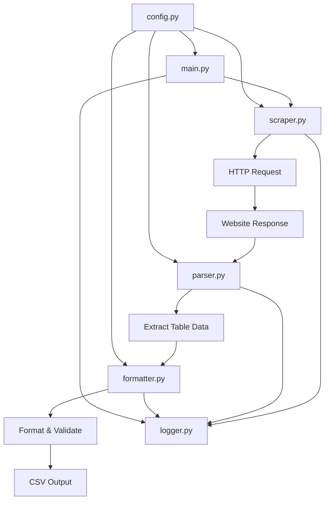

# Artificial Analysis Leaderboard Scraper - Technical Architecture

## Project Overview

This document outlines the technical architecture for a Python web scraper designed to extract leaderboard data from the Artificial Analysis website (https://artificialanalysis.ai/leaderboards/providers/prompt-options/single/medium_coding?deprecation=all).

## Project Structure

```
artificialanalysis-scraper/
├── src/
│   ├── __init__.py
│   ├── scraper.py          # Core HTTP request handling
│   ├── parser.py           # HTML parsing and data extraction
│   ├── formatter.py        # Data formatting and CSV output
│   ├── config.py           # Configuration settings
│   └── logger.py           # Logging configuration
├── specs/
│   ├── architecture.md     # This document
│   ├── requirements.md     # Project requirements
│   └── tasks.md            # Implementation tasks
├── tests/
│   ├── __init__.py
│   ├── test_scraper.py
│   ├── test_parser.py
│   └── test_formatter.py
├── data/
│   └── output/             # CSV output directory
├── logs/                   # Application logs
├── main.py                 # Entry point script
├── requirements.txt        # Python dependencies
├── config.yaml             # Configuration file
└── README.md               # Project documentation
```

## Core Components

### 1. `scraper.py` - HTTP Request Handler
**Responsibility:** Manages all HTTP communication with the target website.

**Key Features:**
- Handles GET requests to the leaderboard URL
- Implements retry logic with exponential backoff
- Manages request headers and user agent rotation
- Handles HTTP errors (404, 500, timeout, etc.)
- Supports session management for potential authentication
- Implements rate limiting to respect website resources

**Key Methods:**
```python
class LeaderboardScraper:
    def __init__(self, config)
    def fetch_page(self, url: str) -> requests.Response
    def handle_pagination(self, base_url: str) -> List[str]
    def _retry_request(self, url: str, max_retries: int) -> requests.Response
```

### 2. `parser.py` - HTML Parser and Data Extractor
**Responsibility:** Parses HTML content and extracts structured data from the leaderboard table.

**Key Features:**
- Uses Beautiful Soup 4 for HTML parsing
- Identifies and extracts table headers dynamically
- Handles different table structures and layouts
- Extracts data from complex table cells (logos, links, formatted text)
- Validates data integrity during extraction
- Handles missing or malformed data gracefully

**Key Methods:**
```python
class LeaderboardParser:
    def __init__(self, html_content: str)
    def extract_table_headers(self) -> List[str]
    def extract_table_rows(self) -> List[Dict[str, Any]]
    def parse_provider_info(self, cell) -> Dict[str, str]
    def parse_model_info(self, cell) -> str
    def parse_metrics(self, cell) -> Union[str, int, float]
    def _clean_text(self, text: str) -> str
```

### 3. `formatter.py` - Data Formatter and CSV Writer
**Responsibility:** Formats extracted data and outputs to CSV files.

**Key Features:**
- Normalizes data types and formats
- Handles data cleaning and validation
- Generates CSV files with proper headers
- Supports different output formats (CSV, JSON)
- Implements data deduplication
- Adds metadata (scrape timestamp, source URL)

**Key Methods:**
```python
class DataFormatter:
    def __init__(self, config)
    def format_leaderboard_data(self, raw_data: List[Dict]) -> pd.DataFrame
    def write_to_csv(self, data: pd.DataFrame, filename: str) -> bool
    def validate_data_integrity(self, data: pd.DataFrame) -> bool
    def _normalize_data_types(self, data: pd.DataFrame) -> pd.DataFrame
```

### 4. `config.py` - Configuration Management
**Responsibility:** Manages application configuration and settings.

**Key Features:**
- Loads configuration from YAML file
- Provides default values for all settings
- Supports environment variable overrides
- Validates configuration parameters

**Configuration Parameters:**
```python
CONFIG = {
    'url': {
        'base_url': 'https://artificialanalysis.ai/leaderboards/providers/prompt-options/single/medium_coding',
        'params': {'deprecation': 'all'}
    },
    'scraping': {
        'max_retries': 3,
        'retry_delay': 1.0,
        'timeout': 30,
        'user_agent': 'ArtificialAnalysis-Scraper/1.0'
    },
    'output': {
        'csv_filename': 'leaderboard_{timestamp}.csv',
        'output_directory': 'data/output'
    },
    'logging': {
        'level': 'INFO',
        'log_file': 'logs/scraper.log'
    }
}
```

### 5. `logger.py` - Logging System
**Responsibility:** Configures and manages application logging.

**Key Features:**
- Structured logging with multiple levels
- File and console output
- Request/response logging
- Error tracking and reporting
- Performance metrics logging

## Data Flow Architecture



### Data Flow Steps:

1. **Initialization Phase:**
   - Load configuration from `config.yaml`
   - Initialize logging system
   - Set up output directories

2. **Data Acquisition Phase:**
   - Send HTTP request to leaderboard URL
   - Handle potential redirects and errors
   - Retrieve HTML content
   - Log request metrics

3. **Data Extraction Phase:**
   - Parse HTML using Beautiful Soup
   - Identify table structure and headers
   - Extract row data with proper typing
   - Handle edge cases and malformed data

4. **Data Processing Phase:**
   - Clean and normalize extracted data
   - Validate data integrity
   - Apply data transformations
   - Add metadata (timestamp, source)

5. **Data Output Phase:**
   - Format data into CSV structure
   - Write to output file
   - Generate summary statistics
   - Log completion status

## Expected Data Structure

Based on website analysis, the extracted data will include:

| Column | Data Type | Description | Example |
|--------|-----------|-------------|---------|
| api_provider | String | Provider company name | "OpenAI", "Google", "Microsoft Azure" |
| model_name | String | AI model name | "GPT-5 (high)", "Gemini 2.5 Pro", "o3" |
| context_window | String | Context window size | "400k", "256k", "1m" |
| intelligence_index | Integer | Performance score | 69, 68, 67 |
| price | String | Pricing information | "$3.4", "$6.1", "$0.8" |
| scrape_timestamp | DateTime | When data was scraped | "2024-01-15T10:30:00Z" |
| source_url | String | Origin URL | Full leaderboard URL |

## Error Handling Strategy

### Network-Level Errors:
- **Connection Timeout:** Implement retry with exponential backoff
- **HTTP 4xx/5xx Errors:** Log error details and attempt alternative approaches
- **Rate Limiting (429):** Respect retry-after headers and implement delays
- **DNS Resolution:** Catch and log networking issues

### Parsing-Level Errors:
- **HTML Structure Changes:** Implement flexible selectors and fallback parsing strategies
- **Missing Data:** Handle gracefully with null/default values
- **Data Type Mismatches:** Implement robust type coercion with validation

### File I/O Errors:
- **Permission Issues:** Check directory permissions and provide clear error messages
- **Disk Space:** Monitor available space and handle gracefully
- **File Locking:** Implement proper file handling with context managers

### Error Recovery Mechanisms:
```python
class ErrorHandler:
    def handle_network_error(self, error: requests.RequestException) -> bool
    def handle_parsing_error(self, error: Exception, context: str) -> Dict
    def handle_io_error(self, error: IOError) -> bool
    def generate_error_report(self) -> Dict[str, Any]
```

## Logging Strategy

### Log Levels and Content:

**INFO Level:**
- Scraping session start/end
- Successfully processed pages
- Data extraction statistics
- CSV file generation status

**DEBUG Level:**
- HTTP request/response details
- HTML parsing steps
- Data transformation operations
- Configuration loading

**WARNING Level:**
- Recoverable errors (retry attempts)
- Data quality issues
- Performance degradation
- Configuration issues

**ERROR Level:**
- Unrecoverable network failures
- Critical parsing errors
- File system errors
- Application crashes

### Log Format:
```
[2024-01-15 10:30:00] [INFO] [scraper.py:45] Successfully fetched page: 200 OK (0.85s)
[2024-01-15 10:30:01] [DEBUG] [parser.py:23] Extracted 45 table rows
[2024-01-15 10:30:02] [INFO] [formatter.py:67] Generated CSV: leaderboard_20240115_103002.csv (45 rows)
```

## Pagination Handling Design

While the current website appears to show all data on a single page, the architecture supports pagination:

### Detection Strategy:
- Check for pagination controls (next/previous buttons, page numbers)
- Monitor for dynamic content loading (AJAX requests)
- Detect infinite scroll implementations

### Implementation Approach:
```python
class PaginationHandler:
    def detect_pagination(self, soup: BeautifulSoup) -> bool
    def extract_page_urls(self, base_url: str) -> List[str]
    def handle_dynamic_loading(self, driver: webdriver) -> List[str]
```

## Performance Considerations

### Optimization Strategies:
- **Request Pooling:** Reuse HTTP connections
- **Caching:** Cache responses for development/testing
- **Parallel Processing:** Handle multiple pages concurrently (when applicable)
- **Memory Management:** Process large datasets in chunks
- **Rate Limiting:** Respect server resources with configurable delays

### Scalability Features:
- Configurable batch processing
- Support for distributed scraping (future enhancement)
- Database output option (in addition to CSV)
- API endpoint for real-time data access

## Security and Compliance

### Best Practices:
- **User Agent Management:** Rotate user agents to appear as legitimate browser traffic
- **Rate Limiting:** Implement respectful crawling speeds
- **robots.txt Compliance:** Check and respect robots.txt directives
- **Legal Compliance:** Ensure adherence to website terms of service

### Data Privacy:
- No personal data collection
- Anonymized logging where applicable
- Secure temporary file handling

## Testing Strategy

### Unit Tests:
- Individual component functionality
- Data parsing accuracy
- Error handling scenarios
- Configuration validation

### Integration Tests:
- End-to-end scraping workflow
- CSV output validation
- Error recovery mechanisms
- Performance benchmarks

### Test Data:
- Mock HTML responses for consistent testing
- Edge case scenarios (malformed data, network issues)
- Regression tests for website changes

This architecture provides a robust, maintainable, and scalable foundation for scraping the Artificial Analysis leaderboard data while handling real-world challenges and potential future requirements.