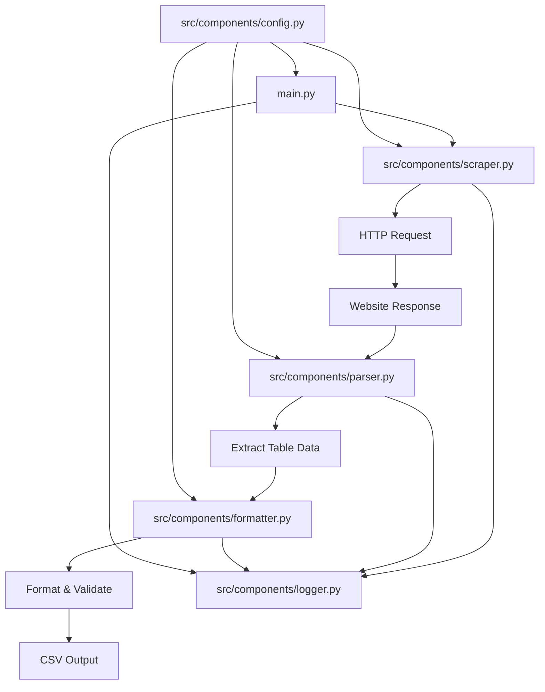

# Artificial Analysis Leaderboard Scraper - Technical Architecture

## Project Overview

This document outlines the technical architecture for a Python web scraper designed to extract leaderboard data from the Artificial Analysis website (https://artificialanalysis.ai/leaderboards/providers/prompt-options/single/medium_coding?deprecation=all).

## Project Structure

```
artificialanalysis-scraper/
├── src/
│   ├── main.py             # Entry point script
│   ├── components/
│   │   ├── scraper.py      # Core HTTP request handling
│   │   ├── parser.py       # HTML parsing and data extraction
│   │   ├── formatter.py    # Data formatting and CSV output
│   │   ├── config.py       # Configuration settings
│   │   └── logger.py       # Logging configuration
├── specs/
│   ├── architecture.md     # This document
│   └── tasks.md            # Implementation tasks
├── tests/
│   ├── test_formatter.py
│   ├── test_main.py
│   ├── test_parser.py
│   ├── test_scraper.py
│   └── test_scraper_spinner.py
├── config.yaml             # Configuration file
├── requirements.txt        # Python dependencies
└── README.md               # Project documentation
```

## Core Components

### 1. `scraper.py` - HTTP Request Handler
**Responsibility:** Manages all HTTP communication with the target website.

**Key Features:**
- Fetches HTML content from the leaderboard URL using Playwright for JavaScript rendering
- Implements retry logic with exponential backoff
- Manages request headers and user agent rotation
- Handles HTTP errors (404, 500, timeout, etc.)
- Implements rate limiting to respect website resources

**Key Functions:**
```python
def fetch_html_with_playwright(url: str, click_header_buttons: bool = True) -> Optional[str]
def fetch_html(url: str, retries: int = 3, delay: int = 5) -> Optional[str]
```

### 2. `parser.py` - HTML Parser and Data Extractor
**Responsibility:** Parses HTML content and extracts structured data from the leaderboard table.

**Key Features:**
- Uses Beautiful Soup 4 for HTML parsing
- Identifies and extracts table headers dynamically
- Handles different table structures and layouts
- Extracts data from complex table cells (logos, links, formatted text)
- Validates data integrity during extraction
- Handles missing or malformed data gracefully

**Key Functions:**
```python
def extract_provider_name(cell) -> str
def parse_leaderboard(html: str) -> List[List[str]]
```

### 3. `formatter.py` - Data Formatter and CSV Writer
**Responsibility:** Formats extracted data and outputs to CSV files.

**Key Features:**
- Normalizes data types and formats
- Handles data cleaning and validation
- Generates CSV files with proper headers
- Supports different output formats (CSV, JSON)
- Implements data deduplication
- Adds metadata (scrape timestamp, source URL)

**Key Functions:**
```python
def format_data_as_csv(data: List[List[Any]]) -> str
def write_to_csv(data: list[list[str]], file_path: str, add_timestamp: bool = True) -> None
```

### 4. `config.py` - Configuration Management
**Responsibility:** Manages application configuration and settings.

**Key Features:**
- Loads configuration from YAML file
- Provides default values for all settings
- Supports environment variable overrides
- Validates configuration parameters

**Key Functions:**
```python
def load_config(config_path: str = "config.yaml") -> Dict[Any, Any]
```

### 5. `logger.py` - Logging System
**Responsibility:** Configures and manages application logging.

**Key Features:**
- Structured logging with multiple levels
- File and console output
- Request/response logging
- Error tracking and reporting
- Performance metrics logging


**Key Functions:**
```python
def setup_logger() -> logging.Logger
```

## Data Flow Architecture


### Data Flow Steps:

1. **Initialization Phase:**
   - Load configuration from `config.yaml`
   - Initialize logging system
   - Set up output directories

2. **Data Acquisition Phase:**
- Fetch HTML content from the leaderboard URL using Playwright
- Handle potential redirects and errors
- Retrieve HTML content
- Log request metrics

3. **Data Extraction Phase:**
   - Parse HTML using Beautiful Soup
   - Identify table structure and headers
   - Extract row data with proper typing
   - Handle edge cases and malformed data

4. **Data Processing Phase:**
   - Clean and normalize extracted data
   - Validate data integrity
   - Apply data transformations
   - Add metadata (timestamp, source)

5. **Data Output Phase:**
   - Format data into CSV structure
   - Write to output file
   - Generate summary statistics
   - Log completion status

## Expected Data Structure

Based on website analysis, the extracted data will include:

The actual structure depends on the HTML table structure from the Artificial Analysis website.
The parser dynamically extracts headers from the table, so the column structure may vary.
However, typical columns include:

| Column | Data Type | Description | Example |
--------|-----------|-------------|---------|
| Provider | String | Provider company name extracted from logos | "Fireworks", "OpenAI" |
| Model | String | AI model name | "gpt-oss-120B (high)", "Gemini 2.5 Pro" |
| Context Window | String | Context window size | "131k", "256k" |
| Performance Metrics | String | Various performance metrics | "69", "68" |

## Error Handling Strategy

### Network-Level Errors:
- **Connection Timeout:** Implement retry with exponential backoff
- **HTTP 4xx/5xx Errors:** Log error details and attempt alternative approaches
- **Playwright Errors:** Handle browser automation errors gracefully

### Parsing-Level Errors:
- **HTML Structure Changes:** Implement flexible selectors and fallback parsing strategies
- **Missing Data:** Handle gracefully with empty values
- **Malformed Data:** Handle gracefully with appropriate defaults

### File I/O Errors:
- **Permission Issues:** Check directory permissions and provide clear error messages
- **File Creation Errors:** Handle gracefully with appropriate error messages

### Error Recovery Mechanisms:
Errors are handled through Python exceptions and logging. Each component logs errors
appropriately and returns None or empty values when operations fail, allowing
the main application to handle failures gracefully.

## Logging Strategy

### Log Levels and Content:

**INFO Level:**
- Scraping session start/end
- Successfully processed pages
- Data extraction statistics
- CSV file generation status

**DEBUG Level:**
- HTTP request/response details
- HTML parsing steps
- Data transformation operations
- Configuration loading

**WARNING Level:**
- Recoverable errors (retry attempts)
- Data quality issues
- Performance degradation
- Configuration issues

**ERROR Level:**
- Unrecoverable network failures
- Critical parsing errors
- File system errors
- Application crashes

### Log Format:
```
[2024-01-15 10:30:00] [INFO] [scraper.py:45] Successfully fetched page: 200 OK (0.85s)
[2024-01-15 10:30:01] [DEBUG] [parser.py:23] Extracted 45 table rows
[2024-01-15 10:30:02] [INFO] [formatter.py:67] Generated CSV: leaderboard_20240115_103002.csv (45 rows)
```

## Terminal Spinner Feature

A terminal spinner has been implemented to provide real-time feedback during the Playwright rendering process.
This feature uses the `rich` library to display a spinner in the terminal, indicating that the scraping process
is in progress.

### Implementation Details:
- Uses `rich.console.Console` for terminal output
- Displays status messages during different phases of Playwright execution
- Updates status messages as the process progresses
- Handles both success and error cases gracefully

### Status Messages:
- "Rendering page with Playwright..."
- "Launching browser..."
- "Navigating to page..."
- "Waiting for page to load..."
- "Clicking headers..." (when header buttons are present)
- "Extracting HTML..."

## Performance Considerations

### Optimization Strategies:
- **Request Pooling:** Reuse HTTP connections
- **Caching:** Cache responses for development/testing
- **Parallel Processing:** Handle multiple pages concurrently (when applicable)
- **Memory Management:** Process large datasets in chunks
- **Rate Limiting:** Respect server resources with configurable delays

### Scalability Features:
- Configurable batch processing
- Support for distributed scraping (future enhancement)
- Database output option (in addition to CSV)
- API endpoint for real-time data access

## Security and Compliance

### Best Practices:
- **User Agent Management:** Rotate user agents to appear as legitimate browser traffic
- **Rate Limiting:** Implement respectful crawling speeds
- **robots.txt Compliance:** Check and respect robots.txt directives
- **Legal Compliance:** Ensure adherence to website terms of service

### Data Privacy:
- No personal data collection
- Anonymized logging where applicable
- Secure temporary file handling

## Testing Strategy

### Unit Tests:
- Individual component functionality
- Data parsing accuracy
- Error handling scenarios
- Configuration validation
- Playwright integration tests
- Spinner functionality tests

### Integration Tests:
- End-to-end scraping workflow
- CSV output validation
- Error recovery mechanisms

### Test Data:
- Mock HTML responses for consistent testing
- Edge case scenarios (malformed data, network issues)
- Playwright mock objects for browser automation testing

This architecture provides a robust, maintainable, and scalable foundation for scraping the Artificial Analysis leaderboard data while handling real-world challenges and potential future requirements.